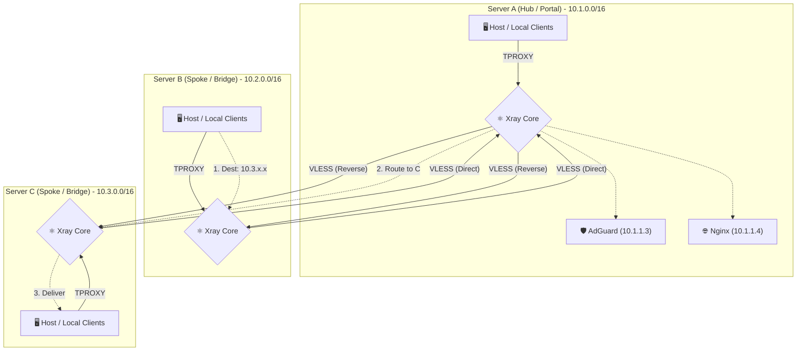

# Xray Subnet Mimicry (10.0.0.0/8)

> [!CAUTION]
> **EDUCATIONAL PURPOSES ONLY**
> This project is designed as a technical demonstration of Xray-core's routing capabilities and private subnet mimicry. It is NOT intended for restriction evasion or illegal activities. Use this knowledge responsibly and in compliance with your local laws.

This repository provides a minimal example of how to mimic a contiguous `10.0.0.0/8` private subnet across three distinct servers using **Xray-core** and **reverse tunneling**.

---

## Technical Deep-Dive & Architecture

### The Virtual Subnet Concept
We are constructing a "Flat Network" (Layer 3) over the public internet. Each node is an authoritative gateway for its own `/16` segment of the `10.0.0.0/8` range.



### The Science of Interception (TPROXY)
Unlike `REDIRECT` which only works for TCP and changes the destination IP to the proxy's IP, **TPROXY** (Transparent Proxy) allows the proxy to intercept both TCP and UDP while preserving the original packet headers.

*   **Mechanism:** When a packet for `10.x.x.x` enters the `PREROUTING` or `OUTPUT` chain, the Linux Mangle table marks it with `0x1`.
*   **Preservation:** Xray's `tunnel` inbound (which intercepts the host's traffic) uses `\"sockopt\": { \"tproxy\": \"tproxy\" }` to read the original destination IP from the socket metadata, allowing it to route the packet as if it were the intended gateway.
*   **Resource:** [Linux Kernel TPROXY Documentation](https://www.kernel.org/doc/Documentation/networking/tproxy.txt)

### Policy Routing (Table 100)
While the `iptables` rules in our firewall *mark* intercepted packets (with `0x1`), marking alone does not change where a packet goes. The standard Linux routing table only cares about the destination IP. If a packet is destined for `10.3.x.x` but there is no physical route, the kernel will send it to the default gateway (the public internet), which will simply drop it.

To make the kernel route traffic based on our firewall mark, we use **Policy Routing**:
1.  **The Rule (`ip rule`):** `ip rule add fwmark 1 lookup 100` tells the Linux networking stack: *"Before doing normal routing, if a packet has firewall mark 1, ignore the main routing table and use Table 100 instead."*
2.  **The Table (`ip route`):** `ip route add local default dev lo table 100` populates Table 100 with a single rule: *"Treat ALL destination IPs as if they belong to this local machine (`local default`), and route them to the internal loopback interface (`dev lo`)."*
3.  **The Handoff:** Because the packet is forced onto the local loopback interface, the `TPROXY` mechanism can finally grab it. Xray, which is listening on `127.0.0.1:12345` with the `tproxy` socket option, intercepts the packet and reads its original destination.
4.  **Loop Prevention:** We use `sockopt: { \"mark\": 255 }` in Xray's outbounds. This "exempts" Xray's own outbound traffic from being caught by our `iptables` rules (since 255 is not 1), preventing an infinite loop where Xray proxies its own traffic.

### The Reverse Proxy Mechanism (Bridge & Portal)
To allow a server behind NAT (Spoke) to be reachable by the Hub, Xray implements a sophisticated Reverse Proxy architecture.

*   **Bridge (The Spoke):** The Bridge actively initiates a connection to the Portal. It acts as the "Client" for the tunnel but functionally behaves as a server once the tunnel is open.
*   **Portal (The Hub):** The Portal listens for these incoming Bridge connections. It uses a "Dummy Domain" (configured in the `reverse` object) to identify the Bridge. When a packet for Spoke B arrives at the Hub, the Hub relays it through the already-open connection from Spoke B. [Xray Reverse Proxy Documentation](https://xtls.github.io/en/config/reverse.html)
*   **Multiplexing (Mux):** Xray uses [Mux.cool](https://xtls.github.io/en/development/protocols/muxcool.html) by default over these tunnels. This allows hundreds of virtual connections (TCP/UDP streams) to be packed into a single physical TLS connection between the Bridge and the Portal, significantly reducing overhead and bypassing NAT timeouts.
*   **VLESS Transport:** We use VLESS with XTLS for high-performance data encapsulation. [Xray VLESS](https://xtls.github.io/en/config/outbounds/vless.html)

## Setup Guide

### Phase 0: Prerequisites (Server A only)
Before starting, Server A (the Hub) requires a valid SSL certificate for Xray's XTLS-Vision.
1.  Point your domain (`A-DOMAIN`) to Server A's public IP.
2.  Generate an SSL certificate (e.g., via Let's Encrypt / Certbot) so that it is available at `/etc/letsencrypt/live/A-DOMAIN/` on the host.

### Phase 1: Security & Identity
Each connection needs its own cryptographic "Key" (UUID).
1.  **Generate 4 UUIDs**:
    ```bash
    docker run --rm ghcr.io/xtls/xray-core uuid
    ```
2.  **Mapping**:
    *   `UUID_B_REVERSE`: Tunnel control for Server B.
    *   `UUID_B_DIRECT`: Data traffic for Server B.
    *   `UUID_C_REVERSE`: Tunnel control for Server C.
    *   `UUID_C_DIRECT`: Data traffic for Server C.

### Phase 2: Host Networking (The Glue)
On **EVERY** server node:

1.  **Initialize Routing**: Run [routing.sh](./routing.sh). This sets up the kernel parameters and the custom routing Table 100.
2.  **Firewall Injection**: Open `/etc/ufw/before.rules` and find the `*filter` header.
    **CRITICAL PLACEMENT:** Insert the contents of your node's `before.rules` file immediately after these lines. The provided files contain `COMMIT` commands and new table declarations specifically crafted to be pasted here without breaking UFW.
    ```bash
    *filter
    :ufw-before-input - [0:0]
    :ufw-before-output - [0:0]
    :ufw-before-forward - [0:0]
    :ufw-not-local - [0:0]
    # End required lines
    ```
    **Files to Copy:**
    *   **Server A**: Copy [a/before.rules](./a/before.rules)
    *   **Server B**: Copy [b/before.rules](./b/before.rules)
    *   **Server C**: Copy [c/before.rules](./c/before.rules)
3.  **Reload**: `sudo ufw reload`

### Phase 3: Deployment
1.  **Update Configs**: In each `xray.jsonc`, replace:
    *   `REPLACE_WITH_UUID_...` with your generated IDs.
    *   `A-DOMAIN` with your public domain.
    *   `A-EXTERNAL-IP` with Server A's public IP.
2.  **Launch**: `docker compose up -d` in the `a/`, `b/`, and `c/` directories.
    *(Note: On Server A, Docker Compose automatically creates the `10.1.0.0/16` bridge network and assigns static IPs to the AdGuard (`10.1.1.3`) and Nginx (`10.1.1.4`) containers.)*

## Educational Resources & References
*   **Xray-core Official Documentation:** [XTLS.github.io](https://xtls.github.io/)
*   **Project X (Xray) GitHub:** [XTLS/Xray-core](https://github.com/XTLS/Xray-core)
*   **Understanding TPROXY:** [Cloudflare Blog: TPROXY](https://blog.cloudflare.com/how-we-built-spectrum/) - excellent deep dive into how transparent proxying works at scale.

## Copyright & License

**Information described here** is licensed under the [CC-BY-4.0](./LICENSE).

Software and tools mentioned or used within this repository are licensed individually under their respective terms and conditions by their original authors.

---

AI Assistance: Information in this repository was enhanced and formatted with the use of Large Generative Models _(sadly, they are incapable of correctly setting up the processes described here by themselves - otherwise, this repository wouldn't exist)_.

Copyright © 2026 Vladimir Eremin
